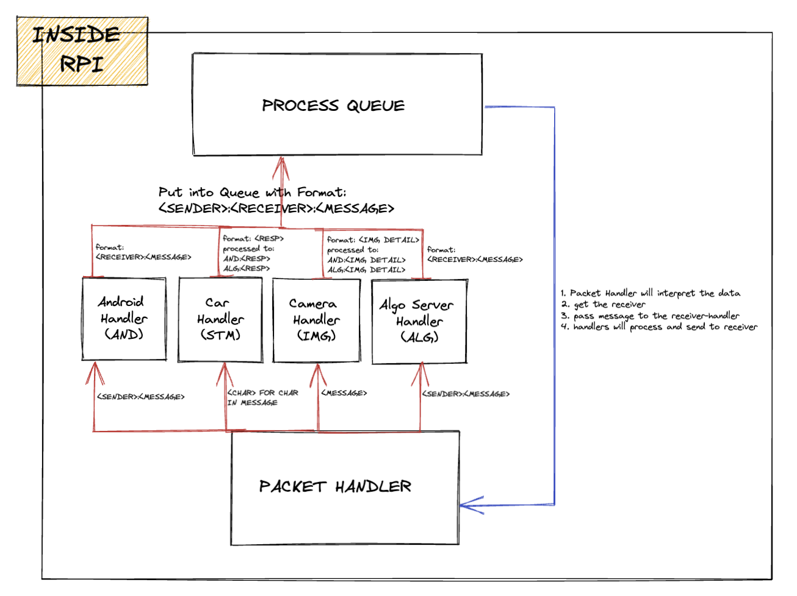
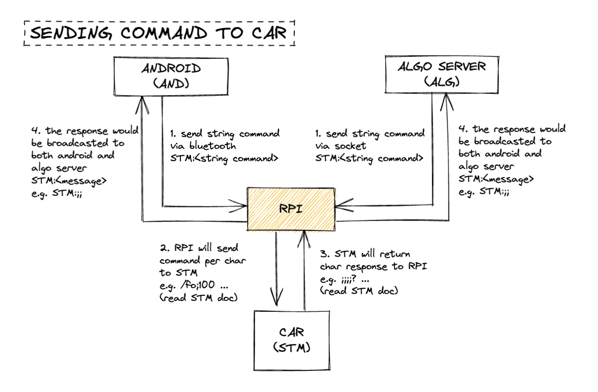
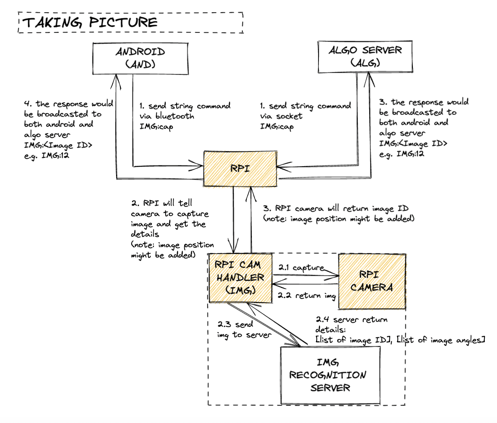
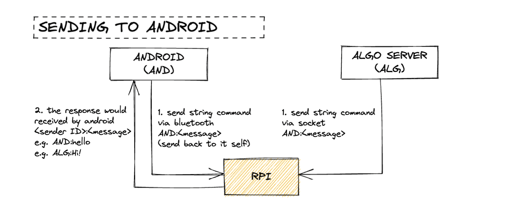

# How to run this app:

1. run `sudo apt-get install libatlas-base-dev` for imagezmq lib
1. install all requirements (`requirements.txt` will be made soon)
1. change the variables in `env.py`
1. connect all devices to the RPI
1. make sure image processing server is running
1. run `python app.py`


----

# Notes:

For Car:

- Change the `CAR_RECIVER_ID` in `env.py` to the desired receiver.
- The message will be directly sent to it. Options same as below: `STM, AND, ALG, IMG`

For Android, and Algo server:

- In every message, please specify the receiver by specifying 
its ID (from below) in this format: `<ID>:<message>`

- Example: `AND:Hello android!`

```
    'STM': "RC-Car"
    'AND': "ANDROID"
    'ALG': "ALGORITHM PC"
    'IMG': "PI-CAMERA"
```

- For Data to Car, please read the readme in its [repository](https://github.com/cruzerngz/MDP_STM32/tree/devel).
-  For Pi Camera, send any message with minimum 1 character to trigger image capturing (`IMG:cap`). Send `IMG:DONE` to end process and create collage on image processing server.
- Result from Pi Camera will be sent to `CAMERA_RECEIVER` in `env.py.

For Camera Server:
- image will be sent using `imagezmq`
- if message is `DONE`, Yolo5 will be terminated and collage of detected images will be made into a collage.

---

# Design:





